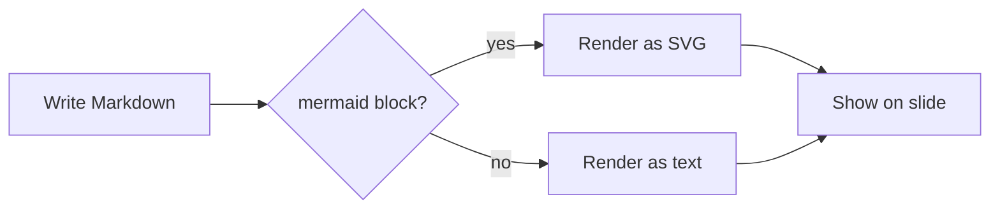

## Flowcharts, too

Fenced `mermaid` code blocks render as real diagrams:

```mermaid
flowchart LR
  A[Write Markdown] --> B{mermaid block?}
  B -- yes --> C[Render as SVG]
  B -- no --> D[Render as text]
  C --> E[Show on slide]
  D --> E
```

Sequence, class, state, pie, and Gantt diagrams work as well.
